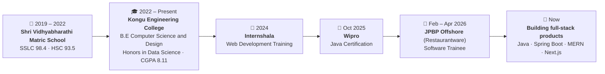
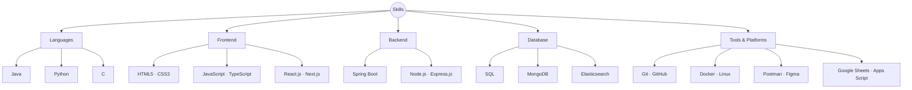
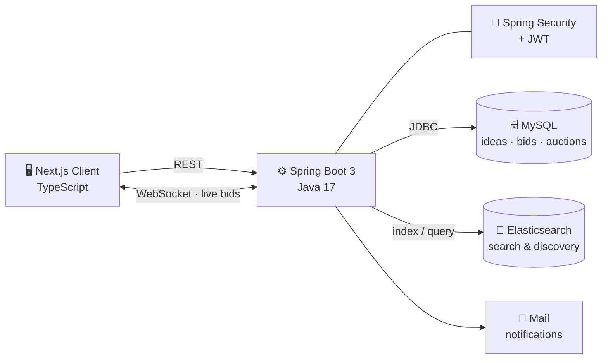
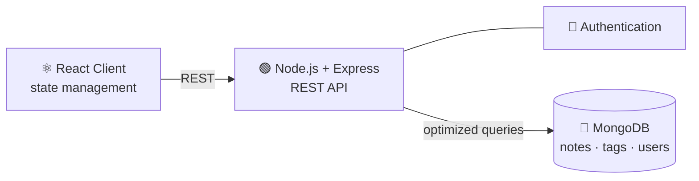
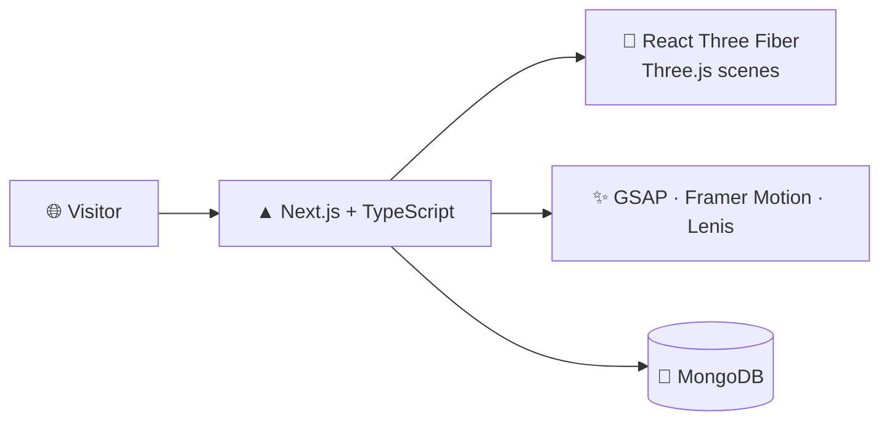
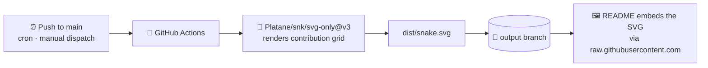

<div align="center">


<a href="https://git.io/typing-svg">
  
</a>

<br/>


<br/><br/>

<a href="https://www.linkedin.com/in/ram-prasanth2802">
  
</a>
<a href="mailto:ramprasanth2802@gmail.com">
  
</a>
<a href="https://github.com/Ramprasanth7119">
  
</a>
<a href="https://ram2802.vercel.app">
  
</a>


</div>


<div align="center">

### 🖥️ This README is a terminal. Click any command to run it.

<kbd><a href="#whoami">$ whoami</a></kbd> &nbsp;
<kbd><a href="#journey">$ history</a></kbd> &nbsp;
<kbd><a href="#experience">$ cat experience.log</a></kbd> &nbsp;
<kbd><a href="#skills">$ ls ~/skills</a></kbd> &nbsp;
<kbd><a href="#projects">$ ./projects --all</a></kbd> &nbsp;
<kbd><a href="#education">$ cat education.yml</a></kbd> &nbsp;
<kbd><a href="#certs">$ ls ~/certs</a></kbd> &nbsp;
<kbd><a href="#stats">$ git stats</a></kbd> &nbsp;
<kbd><a href="#contact">$ ./contact.sh</a></kbd>

<sub>Every section below is collapsible — expand what interests you, skip what doesn't.</sub>

</div>

<br/>

<a id="whoami"></a>

<details open>
<summary><h3>💬 &nbsp;<code>$ whoami --verbose</code></h3></summary>

<br/>

```yaml
name:       "Ramprasanth Sakthivel"
role:       "Software Developer"
location:   "Namakkal, India"
education:  "B.E Computer Science and Design (Honors in Data Science)"
college:    "Kongu Engineering College · 2022 – Present"
cgpa:       8.11
experience: "Software Trainee @ JPBP Offshore (Restaurantware)"
core_stack: ["Java", "Spring Boot", "MERN", "Next.js", "Elasticsearch"]
status:     "Open to opportunities"
```

Software Developer with hands-on experience in web development using the **MERN stack** and **Java Spring Boot**, along with industry exposure as a **Software Trainee**. Skilled in building scalable web applications, APIs, and working with modern databases.

Seeking an opportunity to contribute to real-world projects while continuously enhancing technical expertise.

> [!NOTE]
> **Currently open to Software Developer roles.** The fastest way to reach me is [email](mailto:ramprasanth2802@gmail.com) or [LinkedIn](https://www.linkedin.com/in/ram-prasanth2802).

</details>

<a id="journey"></a>

<details>
<summary><h3>🧭 &nbsp;<code>$ history --timeline</code></h3></summary>

<br/>



</details>

<a id="experience"></a>

<details>
<summary><h3>💼 &nbsp;<code>$ cat experience.log</code></h3></summary>

<br/>

### Software Trainee &nbsp;·&nbsp; JPBP Offshore Private Limited (Restaurantware)


| | What I did |
| :-- | :-- |
| 🎨 **Frontend** | Trained in full-stack development using HTML, CSS, JavaScript, TypeScript, and **Vue.js** |
| ⚙️ **Backend** | Developed backend components using **Java** and **Spring Boot** |
| 🗄️ **Data & Search** | Worked with **SQL** and **Elasticsearch** for data handling and search optimization |
| 🤖 **Automation** | Automated workflows using **Google Apps Script** and **Google Sheets** |
| 🧪 **Quality** | Performed software testing and QA to identify and resolve bugs |
| 🤝 **Teamwork** | Collaborated with team members on internal product modules |

</details>

<a id="skills"></a>

<details>
<summary><h3>🧬 &nbsp;<code>$ ls -R ~/skills</code></h3></summary>

<br/>



<details>
<summary><b>📂 languages/</b></summary>
<br/>

<br/><br/>

| Language | Where I use it |
| :-- | :-- |
| **Java** | Spring Boot services, REST APIs, backend logic |
| **Python** | Scripting and problem solving |
| **C** | Programming fundamentals |

</details>

<details>
<summary><b>📂 frontend/</b></summary>
<br/>

<br/><br/>

`HTML5` · `CSS3` · `JavaScript` · `TypeScript` · `React.js` · `Next.js`

</details>

<details>
<summary><b>📂 backend/</b></summary>
<br/>

<br/><br/>

`Spring Boot` · `Node.js` · `Express.js`

</details>

<details>
<summary><b>📂 database/</b></summary>
<br/>


<br/><br/>

| Store | Used for |
| :-- | :-- |
| **SQL** | Transactional, relational data |
| **MongoDB** | Document storage in MERN applications |
| **Elasticsearch** | Keyword search, filtering, and discovery |

</details>

<details>
<summary><b>📂 tools/</b></summary>
<br/>

<br/><br/>

`Git` · `GitHub` · `Postman` · `Figma` · `Linux` · `Docker` · `Google Sheets` · `Google Apps Script`

</details>

</details>

<a id="projects"></a>

<details open>
<summary><h3>🚀 &nbsp;<code>$ ./projects --all</code></h3></summary>

<br/>

<details open>
<summary><b>💡 &nbsp;iHub — Idea Bidding Platform</b> &nbsp;<code>Spring Boot · MySQL · Elasticsearch · Next.js</code></summary>

<br/>

<a href="https://github.com/Ramprasanth7119/ihub"></a>
<a href="https://ihub-wheat.vercel.app"></a>

A platform connecting **idea creators with investors** — creators post ideas, investors bid, and auctions resolve in real time.

- Built a platform for idea creators and investors with idea posting, bidding, and auction features
- Developed **REST APIs** for idea management, bid handling, search, filtering, and real-time auction updates
- Integrated **MySQL** for transactional data and **Elasticsearch** for efficient keyword-based search and discovery
- Designed and implemented a **Next.js** frontend for an interactive user experience



<details>
<summary><i>🔍 Deeper look at the backend</i></summary>
<br/>

| Concern | How it's handled |
| :-- | :-- |
| **Authentication** | Spring Security with JWT-issued tokens |
| **Transactions** | MySQL over Spring JDBC for ideas, bids, and auction state |
| **Search** | Elasticsearch index for keyword search, filtering, discovery |
| **Real time** | WebSocket channel pushing live auction and bid updates |
| **Notifications** | Spring Mail for transactional email |
| **Runtime** | Java 17 · Dockerfile + `docker-compose` for local orchestration |

</details>

</details>

<br/>

<details>
<summary><b>📝 &nbsp;Notes App</b> &nbsp;<code>MERN Stack</code></summary>

<br/>

<a href="https://github.com/Ramprasanth7119/notes_app"></a>
<a href="https://notes-app-rho-hazel.vercel.app"></a>

A full-stack note-taking application built on the **MERN** stack.

- Built a full-stack **CRUD** application with authentication, tagging, and search functionality
- Optimized data retrieval using efficient **MongoDB queries** and **React state management**
- Designed a **responsive UI** for a seamless user experience across devices



</details>

<br/>

<details>
<summary><b>🌌 &nbsp;Portfolio</b> &nbsp;<code>Next.js · TypeScript · Three.js</code></summary>

<br/>

<a href="https://github.com/Ramprasanth7119/portfolio_ram"></a>
<a href="https://ram2802.vercel.app"></a>

My personal portfolio — an interactive site built with **Next.js** and **TypeScript**, using 3D scenes and motion to present my work.

- **3D rendering** with Three.js via React Three Fiber and Drei
- **Motion & scroll** built on GSAP, Framer Motion, and Lenis smooth scrolling
- **MongoDB** for dynamic content



</details>

<br/>

> [!TIP]
> More of my work lives on [github.com/Ramprasanth7119](https://github.com/Ramprasanth7119?tab=repositories) — most repositories ship with a live deployment.

</details>

<a id="education"></a>

<details>
<summary><h3>🎓 &nbsp;<code>$ cat education.yml</code></h3></summary>

<br/>

```yaml
- institution: "Kongu Engineering College"
  period:      "2022 – Present"
  degree:      "B.E Computer Science and Design"
  honors:      "Honors in Data Science"
  cgpa:        8.11

- institution: "Shri Vidhyabharathi Matric School"
  period:      "2019 – 2022"
  level:       "Higher Secondary and Secondary Education"
  hsc:         93.5
  sslc:        98.4
```

| Institution | Period | Qualification | Score |
| :-- | :-- | :-- | :-- |
| **Kongu Engineering College** | 2022 – Present | B.E Computer Science and Design *(Honors in Data Science)* | CGPA **8.11** |
| **Shri Vidhyabharathi Matric School** | 2019 – 2022 | Higher Secondary & Secondary | HSC **93.5** · SSLC **98.4** |

</details>

<a id="certs"></a>

<details>
<summary><h3>📜 &nbsp;<code>$ ls ~/certs</code></h3></summary>

<br/>

| Certification | Issuer | Year |
| :-- | :-- | :-- |
| 🌐 **Web Development Training** | Internshala | 2024 |
| ☕ **Java Certification** | Wipro | Oct 2025 |

</details>

<a id="stats"></a>

<details>
<summary><h3>📊 &nbsp;<code>$ git stats --graph</code></h3></summary>

<br/>

<div align="center">


</div>

</details>

<br/>

<div align="center">

### 🐍 The snake eats my contributions


<sub>Regenerated automatically every 12 hours by a GitHub Action — see <a href="#how">how it works</a>.</sub>

</div>

<a id="how"></a>

<details>
<summary><h3>⚙️ &nbsp;<code>$ cat .github/workflows/*.yml</code> &nbsp;<sub>— how this profile builds itself</sub></h3></summary>

<br/>

This repository is my **GitHub profile repository**: its `README.md` renders on my profile page, and scheduled GitHub Actions keep the visuals current with no manual work.

```text
Ramprasanth7119/
├── .github/
│   └── workflows/
│       ├── snake.yml      # contribution snake  → output branch
│       └── pacman.yml     # pac-man graph       → output branch
└── README.md              # the page you're reading
```



| Workflow | Trigger | Action | Publishes to |
| :-- | :-- | :-- | :-- |
| `snake.yml` | Push to `main`, every 12h, manual | [`Platane/snk/svg-only@v3`](https://github.com/Platane/snk) | `output` → `snake.svg` |
| `pacman.yml` | Daily, manual | [`abozanona/pacman-contribution-graph`](https://github.com/abozanona/pacman-contribution-graph) | `output` |

Both publish via [`crazy-max/ghaction-github-pages@v3.1.0`](https://github.com/crazy-max/ghaction-github-pages) using the default `GITHUB_TOKEN` — no personal access token required.

</details>

<details>
<summary><h3>🥚 &nbsp;<code>$ ./secret</code></h3></summary>

<br/>

You expanded a section labelled *secret* on a stranger's profile. That instinct — *"what happens if I click this?"* — is the same one that makes a good engineer.

<details>
<summary><i>…there's another one in here</i></summary>
<br/>

```text
$ echo $PHILOSOPHY
"Correctness first, speed second.
 Readable code is maintainable code.
 Measure before you optimise."

$ ./hire-me --why
> Ships full-stack: Java/Spring Boot APIs and React/Next.js interfaces
> Comfortable across SQL, MongoDB, and Elasticsearch
> Real industry exposure: trained and shipped at JPBP Offshore
> Still curious enough to click the secret button

$ exit
Thanks for reading all the way down. Let's build something.
```

</details>

</details>


<a id="contact"></a>

<div align="center">

### 🤝 <code>$ ./contact.sh</code>

<a href="https://www.linkedin.com/in/ram-prasanth2802">
  
</a>
<a href="mailto:ramprasanth2802@gmail.com">
  
</a>
<a href="https://ram2802.vercel.app">
  
</a>

<br/><br/>

<i>Open to Software Developer opportunities — let's build something.</i>

<br/><br/>


</div>
